# Stepolution

A Pokemon FireRed/LeafGreen watchface for the Pebble Time 2. Red or Leaf walks around a real FRLG map with a Pokemon following one tile behind. The Pokemon levels up as you walk and evolves at 50% and 100% of your daily step goal. Tomorrow it starts again from level 5.

|                                                     |                                                     |                                                         |                                                      |
| :-------------------------------------------------: | :-------------------------------------------------: | :-----------------------------------------------------: | :--------------------------------------------------: |
|       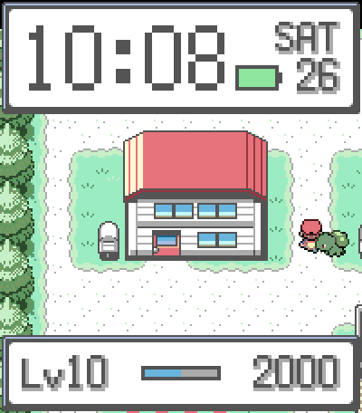        | 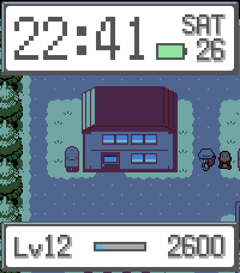 |           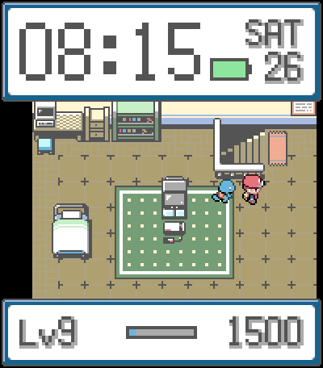           |   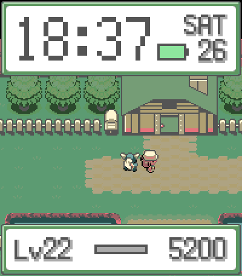   |
|                     Pallet Town                     |                 Pallet Town, night                  |                         Bedroom                         |                    Route 25, dusk                    |
| 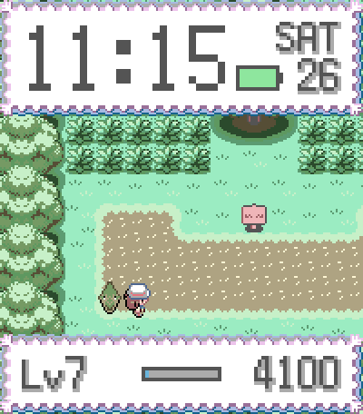 |   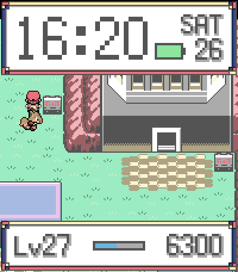   | 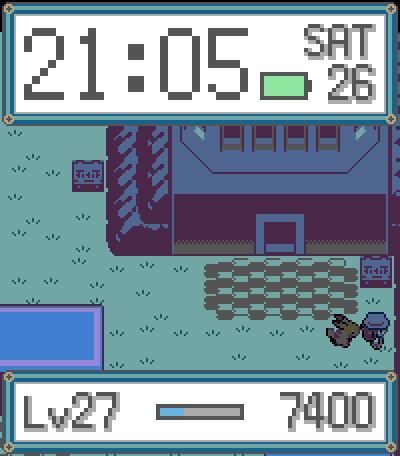 |   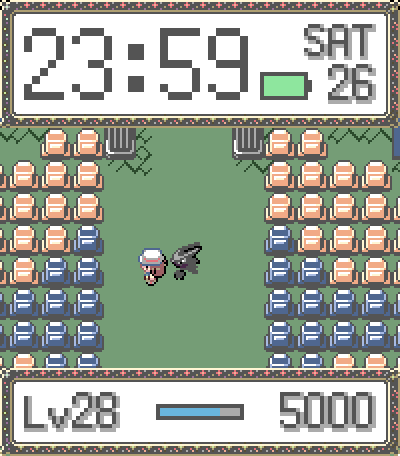    |
|                   Viridian Forest                   |                    Lavender Town                    |                  Lavender Town, night                   |                    Pokemon Tower                     |
|   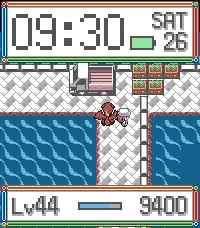   |     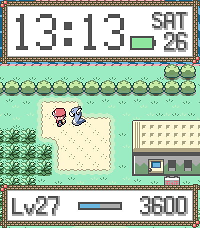     |       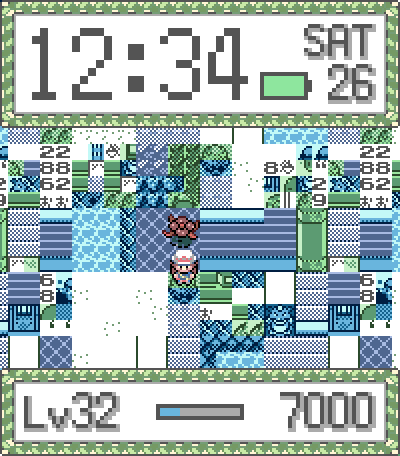       | 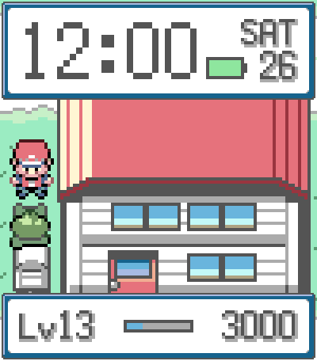 |
|                   S.S. Anne dock                    |                     Safari Zone                     |                       Glitch City                       |                 Pallet Town, 2x zoom                 |

It only runs on the Pebble Time 2 (the `emery` platform). The whole layout is drawn for its 200x228 rectangular color screen, so the Pebble Round 2 and the black and white Pebble 2 Duo aren't supported.

## Installing on your watch

Each GitHub release has a `stepolution-<version>.pbw` attached. That file is the whole watchface, and you don't need the Pebble app store for it.

The simplest way is to download the `.pbw` on your phone and open it with the Pebble app, which offers to install it on the watch.

If you have the SDK, you can also install straight from your computer. In the Pebble app, turn on Developer Connection and note the IP address it shows, then:

```sh
pebble install --phone 192.168.1.20 stepolution-0.1.0.pbw
```

## What you can customise

- Trainer
- Pokemon, or a random one each day
- Location, or a random one each day
- Window frame
- Colors, deeper for the real watch screen or original for the emulator
- Time of day, following the clock or fixed
- Zoom
- How often the trainer wanders
- Pokemon stepping in place while it stands still
- Only animating while the backlight is on
- Daily step goal
- Demo mode

## Building

You need the Pebble SDK (`pebble` CLI, SDK 4.x).

```sh
pebble build
pebble install --emulator emery
```

## Testing on the emulator

```sh
pebble emu-steps --emulator emery 5000          # set today's step count
pebble emu-set-time --emulator emery 21:30:00   # jump to night
```
